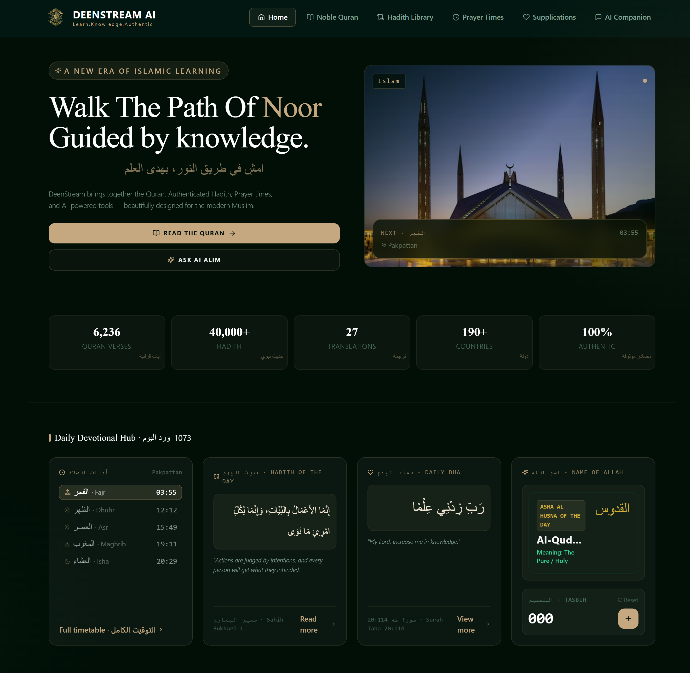

# 
🌊 Deenstream AI

  <strong>Walk The Path Of Noor, Guided by Knowledge.</strong> 
  <em>A premium, ad-free digital sanctuary beautifully engineered to bring peace, stillness, and technical excellence to the global Muslim community.</em>

  
  
  

---

## 
✨ The Vision & Purpose

In today's fast-paced digital world, our screens constantly compete for our attention. As professionals, developers, and creators, we spend hours navigating loud notifications, complex workplace apps, and endless internet noise. 

But a profound friction occurs when it is time for a Muslim to step away from the chaos. When we try to read the Quran, verify a Hadith, check accurate prayer times, or engage in quiet reflection, we are routinely met with clunky user interfaces, intrusive banner ads, and tracking scripts that disrupt our spiritual focus.

**Deenstream AI** was built to solve this. Your spiritual journey deserves the exact same high-caliber design, performance, and attention to detail that we bring to modern enterprise applications. It is an intentional, ad-free digital sanctuary created to protect your attention and help you connect with your Creator seamlessly.

---

## 
📸 Premium Interface Preview

  

---

## 
🌟 Deep-Dive Feature Architecture

### 📖 The Noble Quran Reading Room
* **Elegant Typographic Layout:** Fully responsive, high-contrast Arabic typesetting paired with crisp english translations, intentionally crafted to remove strain during prolonged reading sessions.
* **Fluid Chapter Navigation:** Instant, zero-latency switching between Surahs, chapters, and specific verses without page refreshes or loading disruptions.
* **Immersive Audio Pipeline:** Stream crystal-clear, beautiful recitations natively to help you follow along, memorize, and perfect your pronunciation on the go.

### 🕌 Asynchronous Prayer Intelligence
* **Dynamic Location Mapping:** Real-time calculation mechanics that adapt perfectly to your exact global coordinates to display accurate prayer windows.
* **Clean Visual Timelines:** A silent, minimal dashboard displaying upcoming prayer timelines cleanly, allowing you to prepare your mind for worship without flashing countdown banners.

### 📚 Authenticated Hadith & Supplication Libraries
* **Verified Hadith Streams:** Quick access to structured collections of prophetic narrations, letting you enrich your daily actions with authentic Islamic knowledge.
* **Daily Supplications (Adhkar):** Curated digital cards featuring morning, evening, and situational prayers to keep your tongue moist with the remembrance of Allah throughout a busy day.

### 🤖 Core AI Spiritual Companion
* **Context-Aware Insights:** An intelligent AI search assistant designed to quickly locate specific Quranic context, answer historical inquiries, and provide reliable knowledge streams instantly.

---

## 
🛡️ Premium Guardrails & Performance Metrics

* **🚫 100% Ad-Free, Forever:** No commercial monetization, no flashing pop-ups, and no marketing tracking. Your spiritual focus is sacred.
* **🔒 Absolute Privacy Framework:** No invasive data scraping, tracking pixels, or hidden cookies. Your spiritual routine remains strictly between you and your Creator.
* **⚡ Ultra-Lightweight Mobile Footprint:** Built on a lightning-fast modern stack optimized specifically to load instantly over mobile networks, keeping it lightweight when you are traveling or between tasks.

---

## 
🌍 Connect & Explore

This architecture was not engineered to pad a resume, build an algorithmic brand, or fulfill corporate metrics. It was built purely out of love as a form of **Sadaqah Jariyah** (continuous charity)—utilizing the professional technical skills given to us to create a product that carries weight beyond the screen.

We invite you to step away from the internet's noise, explore the live platform completely, and allow it to bring a sense of quiet stillness back to your day.

✨ **Experience the Live Sanctuary:** https://deenstream-website-navy.vercel.app/
